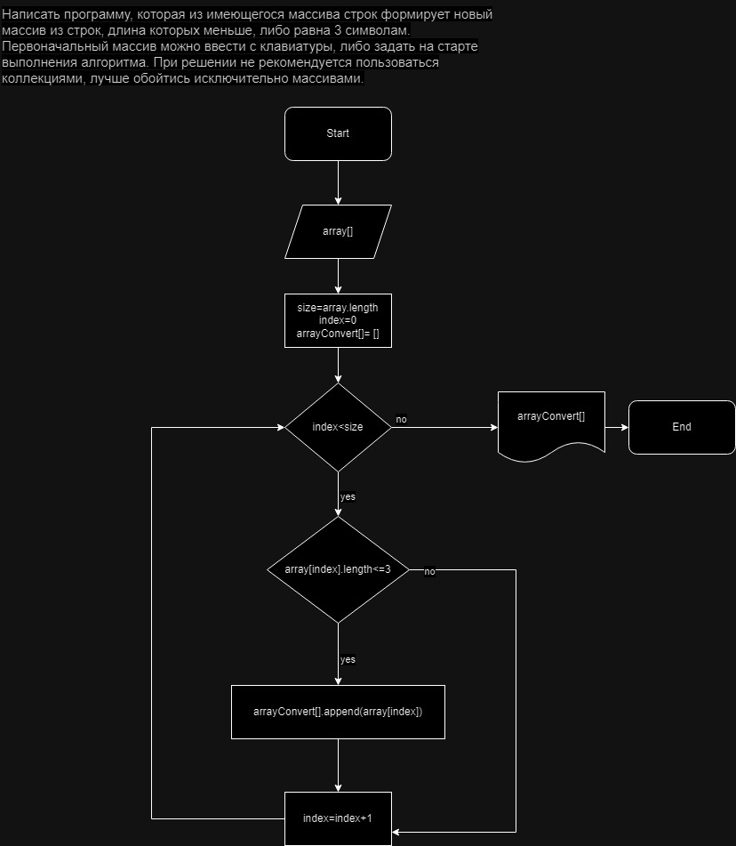

# Контрольная работа

## Задача
Написать программу, которая из имеющегося массива строк формирует новый массив из строк, длина которых меньше, либо равна 3 символам. Первоначальный массив можно ввести с клавиатуры, либо задать на старте выполнения алгоритма. При решении не рекомендуется пользоваться коллекциями, лучше обойтись исключительно массивами.
## Решение
Для решения этой задачи используем простой алгоритм, который проходит по каждой строке исходного массива и проверяет её длину. Если длина строки меньше или равна 3 символам, она добавляется в новый массив.

